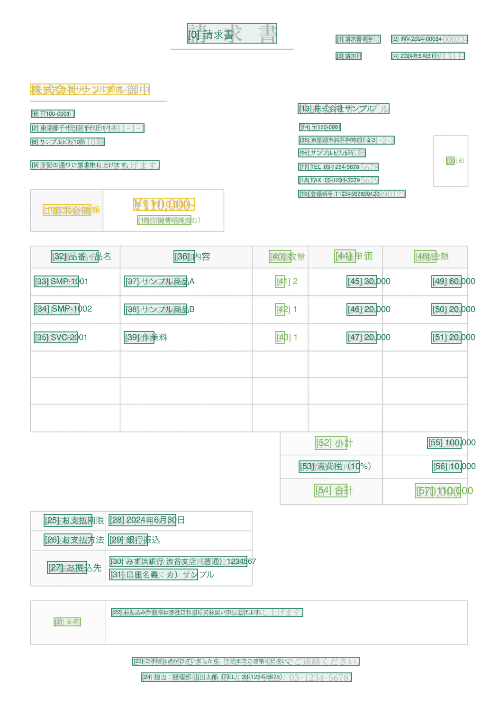

# ai-ocr-pipeline — AI アシスト 日本語 OCR

画像や PDF から日本語テキストを高精度に読み取り、座標付き JSON で出力するツールです。

国立国会図書館の [ndlocr-lite](https://github.com/ndl-lab/ndlocr-lite) をベースに、**LM Studio によるローカル LLM の AI 補正**を組み合わせることで、OCR 単体では読み間違いやすいスキャン帳票・手書き混在文書の精度を大幅に向上させます。

## 特徴

- **AI アシスト OCR** — OCR の検出座標を保ったまま、LLM（LM Studio 経由）がテキストを補正。ndlocr-lite 単体でも動作するため、AI 環境なしでも使える
- **帳票・表に特化したボックス認識チューニング** — ndlocr-lite の検出結果に対し、帳票や表での精度を上げる独自の後処理を適用:
  - テーブル行の自動セル分割（横に長い検出を列の空白で分割）
  - コンテナ fallback 除去（ブロック検出が行検出に昇格する誤検出を排除）
  - 巨大行フィルタ（複数行にまたがる過大な検出を除去）
  - 重複行の NMS（IoU / 包含関係ベースの重複排除）
- **帳票に強い前処理** — 罫線除去・傾き補正で、テーブルのセル検出精度を改善
- **テンプレートモード** — テンプレート JSON で読み取り領域を固定。定型帳票を繰り返し処理する業務に最適
- **構造化 JSON 出力** — 出力結果に座標データを持たせることで、画像なしでもテキストだけでレイアウトを把握でき、文書構造の理解に役立つ。RPA やデータ連携にもそのまま組み込みやすい
- **多様な入力形式** — PDF/PNG/JPEG/TIFF/JP2/BMP と画像ディレクトリ入力に対応
- **読み取り結果を画像で確認** — 検出結果を元画像に重ねた確認用画像を自動出力し、目視確認が容易
- **テンプレートエディタ** — ブラウザで開ける GUI エディタでテンプレート JSON を簡単に作成



## インストール

### 方法 1: pip でインストール

```bash
pip install git+https://github.com/mssoftjp/ai-ocr-pipeline.git
```

> **Note:** この方法では `git` が必要です。`ndlocr-lite` も GitHub リポジトリから直接取得されます。

### 方法 2: ソースからセットアップ（開発用）

```bash
git clone https://github.com/mssoftjp/ai-ocr-pipeline.git
cd ai-ocr-pipeline
./scripts/sync_and_repair.sh
```

> **Note:** この方法では [`uv`](https://docs.astral.sh/uv/) が必要です。`sync_and_repair.sh` は `uv sync --group dev` を実行します。

### ndlocr-lite について

OCR エンジンとして [ndlocr-lite](https://github.com/ndl-lab/ndlocr-lite)（国立国会図書館）を使用しています。

- **pip / ソースからインストールする場合**: ndlocr-lite は依存関係として自動的にインストールされます（モデル重み含む）。別途インストールは不要です。

> **Note:** ndlocr-lite は GitHub リポジトリから直接取得されるため、初回の `pip install` / `uv sync` 時に clone が走ります。ネットワーク環境によっては数分かかる場合があります。

### 動作要件

- Python 3.10 以上
- AI 補正を使う場合: [LM Studio](https://lmstudio.ai/) をローカルで起動

## クイックスタート

```bash
# 基本 — 画像を読み取り、JSON を出力
ai-ocr-pipeline image.png

# PDF の埋め込みテキストを優先して読み取る
ai-ocr-pipeline document.pdf --prefer-text-layer

# 帳票 — 罫線除去で検出精度アップ、結果をディレクトリに保存
ai-ocr-pipeline form.pdf \
  --remove-horizontal-lines --remove-vertical-lines \
  -d results/

# テンプレートモード — 読み取り位置を固定して AI で読み取り
ai-ocr-pipeline form.png \
  --template templates/order_form.json
```

通常モードでは、LM Studio が起動していれば **自動的に AI 補正が有効** になります。起動していなければ OCR のみで動作します。
ただし **テンプレートモード（`--template`）は LM Studio 必須** で、未起動時は OCR のみにフォールバックせずエラーになります。

## AI 補正の仕組み

OCR で検出した各テキストボックスに対し、**画像の切り出し（crop）を LLM に見せてテキストだけを補正** します。座標はそのまま保持されます。

```
画像 → [OCR エンジン] → box 座標 + テキスト → [LLM 補正] → 高精度テキスト
```

### AI バックエンドの選択

| フラグ | 動作 |
|--------|------|
| *(なし)* | LM Studio に接続を試み、成功すれば AI 補正。失敗すれば OCR のみにフォールバック |
| `--lmstudio` | LM Studio を明示指定（接続失敗はエラー） |
| `--ndl` | AI 補正なし、OCR のみ |

`--template` を指定した場合は、`--lmstudio` を明示しなくても LM Studio モードで動作します。未接続時はエラーです。

### LM Studio 側の設定

| 設定 | 推奨値 | 理由 |
|------|--------|------|
| Repeat Penalty | 1.1〜1.2 | 印鑑やノイズ crop でのトークン反復暴走を防止 |

## 出力形式

### 出力先の指定

`-o`、`-d`、`--run-root` は同時指定できません。overlay は `-d` / `--run-root` ではデフォルトで有効、それ以外では無効です。

| フラグ | 動作 |
|--------|------|
| *(なし)* | stdout に JSON |
| `-o result.json` | JSON をファイル保存 |
| `-d results/` | JSON + 確認用画像をディレクトリ保存 |
| `--run-root tmp/runs` | タイムスタンプ付きディレクトリに自動振り分け |

### JSON の構造（要約）

```json
{
  "meta": { "...": "実行条件・統計情報" },
  "results": [
    {
      "source": "input.png",
      "img_width": 800,
      "img_height": 600,
      "boxes": [
        {
          "id": 0,
          "text": "請求書",
          "x": 0.14,
          "y": 0.17,
          "width": 0.15,
          "height": 0.07,
          "confidence": 0.987
        }
      ]
    }
  ]
}
```

各 box の座標は画像サイズに対する比率（0.0〜1.0）で、左上基準です。

## 前処理オプション

| オプション | 効果 |
|-----------|------|
| `--remove-horizontal-lines` | 横罫線を除去（帳票のテーブル検出に有効） |
| `--remove-vertical-lines` | 縦罫線を除去 |
| `--deskew` | スキャンの傾きを自動補正（最大 ±4°） |
| `--dpi <int>` | PDF ラスタライズ解像度（デフォルト: 600） |
| `--prefer-text-layer` | 明示指定時に PDF 埋め込みテキストを使用。足りないページは OCR にフォールバック |

## テンプレートモード

### テンプレートモードとは

通常モードでは OCR エンジンが「どこにテキストがあるか」を自動検出しますが、定型帳票では毎回同じ位置に同じ項目があるため、検出が不安定だと結果がばらつきます。

テンプレートモードは、**読み取り領域をあらかじめ JSON で定義しておく**ことで、box 検出をスキップして AI に直接読み取らせる仕組みです。

| | 通常モード | テンプレートモード |
|--|-----------|-----------------|
| box の位置 | OCR が自動検出 | テンプレート JSON で固定 |
| 毎回の結果 | 検出精度に依存してばらつく | 常に同じ領域を読む |
| 向いている用途 | 未知のレイアウト、多様な文書 | 同じフォーマットの帳票を繰り返し処理 |
| AI の役割 | テキスト補正（任意） | テキスト読み取り（必須） |

### 基本的な使い方

```bash
# テンプレートを指定して実行
ai-ocr-pipeline form.png \
  --template templates/order_form.json

# 特定の box だけ処理（デバッグや部分再処理に便利）
ai-ocr-pipeline form.png \
  --template templates/order_form.json \
  --template-boxes 1,3,5
```

テンプレートモードは AI による読み取りが前提です。`--template` を指定すると自動的に LM Studio モードになるため、`--lmstudio` の明示指定は不要です。`--ndl`（OCR のみ）とは併用できません。

### 処理の流れ

```
テンプレート JSON → 領域を画像に当てはめる → 各領域を crop → AI が読み取り → JSON 出力
```

1. テンプレートの座標を実際の画像サイズに変換
2. 各 box を画像から切り出し、空白かどうか判定
3. 空白でない box だけを LLM に送って読み取り
4. 結果をテンプレートの座標と組み合わせて JSON 出力

空白判定により、記入のない欄は `blank_skip` として AI に送らず処理を高速化します。

### テンプレートの作成方法

#### GUI エディタ（推奨）

同梱のテンプレートエディタをブラウザで開けます。

```bash
# macOS
open tools/template_editor.html

# Windows
start tools\template_editor.html
```

エディタでできること:
- スキャン画像を下地に表示し、ドラッグで読み取り領域を描画
- 各 box にラベル（項目名）と AI ヒント（例: `YYYY/MM/DD`）を設定
- box の複製・分割・整列・均等配置
- 前処理設定（罫線除去・傾き補正）の指定
- 保存前にバリデーションで不足フィールドをチェック

#### 通常 OCR の結果から作る

まず通常モードで OCR を実行し、その結果をエディタに取り込んで微調整する方法も便利です。

```bash
# 1. まず通常 OCR で結果を出す
ai-ocr-pipeline form.png -o tmp/result.json

# 2. エディタで result.json を「OCR 結果を取り込む」から読み込み
# 3. box の位置を調整してテンプレートとして保存
```

### テンプレート JSON の書式

```json
{
  "template": {
    "name": "order_form",
    "version": 1,
    "coordinate_mode": "ratio"
  },
  "preprocess": {
    "remove_horizontal_lines": true,
    "remove_vertical_lines": true,
    "newline_handling": "join"
  },
  "boxes": [
    {
      "id": 1,
      "label": "注文日",
      "hint": "YYYY/MM/DD",
      "x": 0.1,
      "y": 0.16,
      "width": 0.3,
      "height": 0.12
    },
    {
      "id": 2,
      "label": "金額",
      "x": 0.1,
      "y": 0.44,
      "width": 0.225,
      "height": 0.12,
      "is_vertical": true
    }
  ]
}
```

#### 主なフィールド

| フィールド | 必須 | 説明 |
|-----------|------|------|
| `template.name` | Yes | テンプレート名 |
| `template.version` | Yes | `1` を指定 |
| `template.coordinate_mode` | Yes | `"ratio"`（0.0〜1.0）または `"pixel"` |
| `boxes[].id` | Yes | box の識別番号（出力 JSON に反映） |
| `boxes[].label` | No | 項目名。AI のプロンプトに含まれ、読み取り精度を向上させる |
| `boxes[].hint` | No | AI への補足情報（例: 日付形式、数値範囲など） |
| `boxes[].x`, `y`, `width`, `height` | Yes | 左上基準の座標とサイズ |
| `boxes[].is_vertical` | No | 縦書きフラグ |

#### 座標モード

- **ratio モード**: 座標を 0.0〜1.0 の比率で指定。画像サイズが変わっても同じテンプレートが使える
- **pixel モード**: px で指定。`template.reference_size` に基準画像サイズを記載し、実画像に自動スケーリング

#### 前処理設定（preprocess）

テンプレートに前処理のデフォルトを埋め込めます。CLI フラグで上書きも可能です。

| フィールド | 説明 |
|-----------|------|
| `deskew` | 傾き補正 |
| `remove_horizontal_lines` | 横罫線除去 |
| `remove_vertical_lines` | 縦罫線除去 |
| `newline_handling` | 改行の扱い: `"join"`（結合）/ `"first_line"`（先頭行のみ）/ `"preserve"`（保持） |

### テンプレートモードのコツ

- **label を設定する** — 「注文日」「金額」などのラベルは AI のプロンプトに含まれ、読み取り精度に直結します
- **hint で形式を指示する** — `"YYYY/MM/DD"` や `"数値のみ"` など、期待する出力形式を指示すると誤読が減ります
- **罫線除去を有効にする** — 帳票では罫線が crop に入り込み AI の読み取りを妨げるため、前処理で除去するのが効果的です
- **余白に余裕を持たせる** — box をギリギリに切ると文字が欠けることがあります。少し広めに設定してください

## 読み取り結果の確認

`-d` や `--run-root` で出力すると、検出結果を元画像に重ねた確認用画像が自動生成されます。`--overlay` を付ければ stdout や `-o` 出力でも生成できます。信頼度に応じて色分けされ、読み取り結果を目視で確認できます。

## 全オプション一覧

### 入出力

```
ai-ocr-pipeline <input_path> [options]
```

`input_path` には画像ファイル、PDF、またはディレクトリを指定できます。
`-o` / `-d` / `--run-root` は排他的です。

| オプション | 説明 |
|-----------|------|
| `-o <PATH>` | JSON 出力先ファイル |
| `-d <DIR>` | JSON + 確認用画像をディレクトリ保存 |
| `--run-root <DIR>` | タイムスタンプ付きディレクトリに振り分け |
| `--pretty` / `--no-pretty` | JSON の表示形式を切替。`--pretty` は改行・インデント付きの見やすい形式、`--no-pretty` は 1 行のコンパクト形式。未指定時は、ターミナル出力なら pretty、パイプ/リダイレクト時は compact を自動選択 |
| `--overlay` / `--no-overlay` | 確認用画像の生成を強制 on/off |
| `--include-absolute-geometry` / `--no-include-absolute-geometry` | pixel 座標を JSON に追加。テンプレートモードでは未指定時 off |
| `--include-debug-fields` / `--no-include-debug-fields` | 診断フィールドを JSON に追加。テンプレートモードでは未指定時 off |

### AI バックエンド

| オプション | デフォルト | 説明 |
|-----------|-----------|------|
| `--lmstudio` | — | LM Studio を明示指定 |
| `--openai` | — | 将来向けプレースホルダ。現状は未実装 |
| `--gemini` | — | 将来向けプレースホルダ。現状は未実装 |
| `--ndl` | — | AI 補正なし（OCR のみ） |

### LLM 補正

| オプション | デフォルト | 説明 |
|-----------|-----------|------|
| `--llm-base-url` | `http://127.0.0.1:1234/v1` | LM Studio エンドポイント |
| `--llm-model` | 自動検出 | モデル ID |
| `--llm-api-key` | なし | API キー |
| `--llm-max-tokens` | 4096 | 1 リクエストあたり最大トークン数 |
| `--llm-max-workers` | 16 | 並列リクエスト数 |
| `--llm-hint-mode` | full | OCR ヒントの扱い（`full` / `weak` / `none`） |
| `--llm-confidence-threshold` | なし | 高 confidence box の AI 補正スキップ閾値 |
| `--llm-context-confidence` | 0.5 | 近傍ラベル文脈を追加する confidence 閾値 |
| `--llm-timeout` | 120.0 | リクエストタイムアウト（秒） |

### 前処理

| オプション | デフォルト | 説明 |
|-----------|-----------|------|
| `--deskew` / `--no-deskew` | off | 傾き補正 |
| `--remove-horizontal-lines` / `--no-remove-horizontal-lines` | off | 横罫線除去 |
| `--remove-vertical-lines` / `--no-remove-vertical-lines` | off | 縦罫線除去 |
| `--dpi` | 600 | PDF ラスタライズ DPI |
| `--prefer-text-layer` / `--no-prefer-text-layer` | off | 明示指定時に PDF 埋め込みテキストを使用 |
| `--device` | cpu | 推論デバイス（`cpu` / `cuda`） |
| `--ocr-backend` | direct | `direct`（高速）または `subprocess`（レガシー） |
| `--ocr-filter-container-fallbacks` / `--no-ocr-filter-container-fallbacks` | on | 誤検出の巨大要素を除去。`direct` 専用 |
| `--ocr-split-wide-lines` / `--no-ocr-split-wide-lines` | on | 横長の行をセル単位に分割。`direct` 専用 |
| `--ocr-split-level` | 2 | 行分割レベル。大きいほど積極的に分割。`direct` 専用 |

### テンプレート

| オプション | 説明 |
|-----------|------|
| `--template <PATH>` | テンプレート JSON を指定 |
| `--template-boxes <IDs>` | 処理する box ID（例: `1,3,5`） |

### デバッグ / 絞り込み

| オプション | デフォルト | 説明 |
|-----------|-----------|------|
| `--llm-crop-padding` | 0.25 | crop 余白比率 |
| `--llm-box-indices <IDs>` | なし | AI 補正対象 box を限定（例: `0,3,7`） |
| `--llm-save-crops <DIR>` | なし | crop 画像を保存 |

旧 `--ocr-split-gap-sensitivity` も後方互換のため受け付けますが、非推奨かつヘルプでは非表示です。新規利用では `--ocr-split-level` を使ってください。

## よくある使い方

### スキャン帳票を高精度に読み取る

```bash
# LM Studio を起動した状態で:
ai-ocr-pipeline invoice.pdf \
  --remove-horizontal-lines --remove-vertical-lines \
  -d results/
```

表のセルが一つにまとまって検出されるときは、行分割レベルを上げると改善することがあります。

```bash
ai-ocr-pipeline invoice.pdf \
  --ocr-split-level 4 \
  -d results/
```

### 定型帳票を自動処理する

1. テンプレートエディタで読み取り領域を定義
2. テンプレートモードで実行

```bash
ai-ocr-pipeline scanned_form.png \
  --template templates/my_form.json \
  -d results/
```

### AI なしで素早く処理する

```bash
ai-ocr-pipeline image.png --ndl
```

### PDF の埋め込みテキストを使う

```bash
ai-ocr-pipeline document.pdf --prefer-text-layer
```

埋め込みテキストが十分に取れないページだけ、OCR に自動フォールバックします。

## ライセンス

このリポジトリの**オリジナル実装部分**は MIT License です。

ただし、OCR 実行時には `ndlocr-lite` に依存します。`ndlocr-lite` は国立国会図書館により `CC BY 4.0` で公開されています。

このリポジトリは、第三者コンポーネントを MIT へ再ライセンスするものではありません。
`ndlocr-lite` や vendored code には、それぞれ元のライセンス条件が適用されます。

詳細な帰属表示と同梱ライセンス情報は [THIRD_PARTY_NOTICES.md](THIRD_PARTY_NOTICES.md)
を参照してください。
